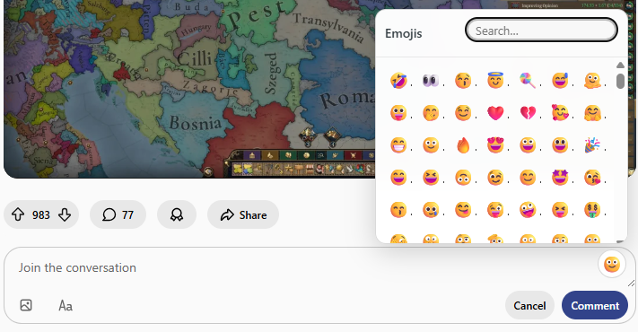

# Reddit Desktop Emoji Picker

Enhances Reddit's **desktop rich-text comment editor** with a searchable
emoji picker and recent emoji support when the built-in picker is
unavailable.

Built as a Manifest V3 Chrome extension using vanilla JavaScript.

------------------------------------------------------------------------

## ✨ Features

-   🔎 Searchable emoji picker
-   🧠 Multi-term keyword matching
-   🗂️ Recently used emojis (Chrome storage-backed)
-   ⚡ Preloaded emoji dataset for smooth first open
-   🖥️ Desktop-focused (browser extension)

------------------------------------------------------------------------

## 🚀 Installation (Development Mode)

1.  Clone the repository:

``` bash
git clone https://github.com/glconde/reddit-emoji-picker.git
```

2.  Open Chrome → `chrome://extensions`
3.  Enable **Developer Mode**
4.  Click **Load unpacked**
5.  Select the project folder

------------------------------------------------------------------------

## 🧭 Usage

1.  Open Reddit (new desktop UI)
2.  Focus on a comment input field
3.  Click the floating 🙂 button
4.  Search or select an emoji
5.  Emoji is inserted at your caret position


### **Fig. 1** Sample usage with panel open 

**Note:**\
Designed for desktop browsers. Mobile devices already provide native
emoji keyboards.

------------------------------------------------------------------------

# 🛠 Developer Notes

## Architecture Overview

-   `content.js`\
    Detects Reddit editors, injects UI button, manages caret handling
    and emoji insertion.

-   `picker.js`\
    Renders the emoji panel, search logic, recents handling, and dataset
    loading.

-   `emoji-data.json`\
    Generated emoji dataset derived from official Unicode source.

-   `picker.css`\
    Lightweight styling for panel UI.

------------------------------------------------------------------------

## 🔄 Updating Emoji Dataset

The extension uses a generated dataset based on Unicode's official emoji
definitions.

### 1️⃣ Download latest `emoji-test.txt`

From:

https://unicode.org/Public/emoji/latest/emoji-test.txt

Save it to:

    data/emoji-test.txt

------------------------------------------------------------------------

### 2️⃣ Regenerate dataset

Run:

``` bash
node scripts/generate-emojis.js
```

This will:

-   Parse the Unicode dataset
-   Apply alias mappings from `data/aliases.json`
-   Generate updated `emoji-data.json`

------------------------------------------------------------------------

## 🎨 Icon Generator

`generator.html` is a lightweight internal tool used to generate
extension icons.

To use:

1.  Open `generator.html` in browser
2.  Adjust settings
3.  Export required sizes (16, 32, 48, 128)

------------------------------------------------------------------------

## 🧠 Technical Notes

-   Uses `execCommand("insertText")` for stable insertion in
    React-controlled contenteditable editors.
-   Implements fallback Range-based insertion.
-   Preloads emoji dataset on page load to eliminate visible UI lag.
-   Handles dynamic Reddit SPA navigation using MutationObserver.

------------------------------------------------------------------------
## 📦 Version

Current version: **0.3.01**

------------------------------------------------------------------------

## 👤 Author

George Louie Conde  
Software Developer  
Calgary, AB  
[LinkedIn](https://linkedin.com/in/glconde)  
[GitHub](https://github.com/glconde)

------------------------------------------------------------------------

## 📄 License

MIT
